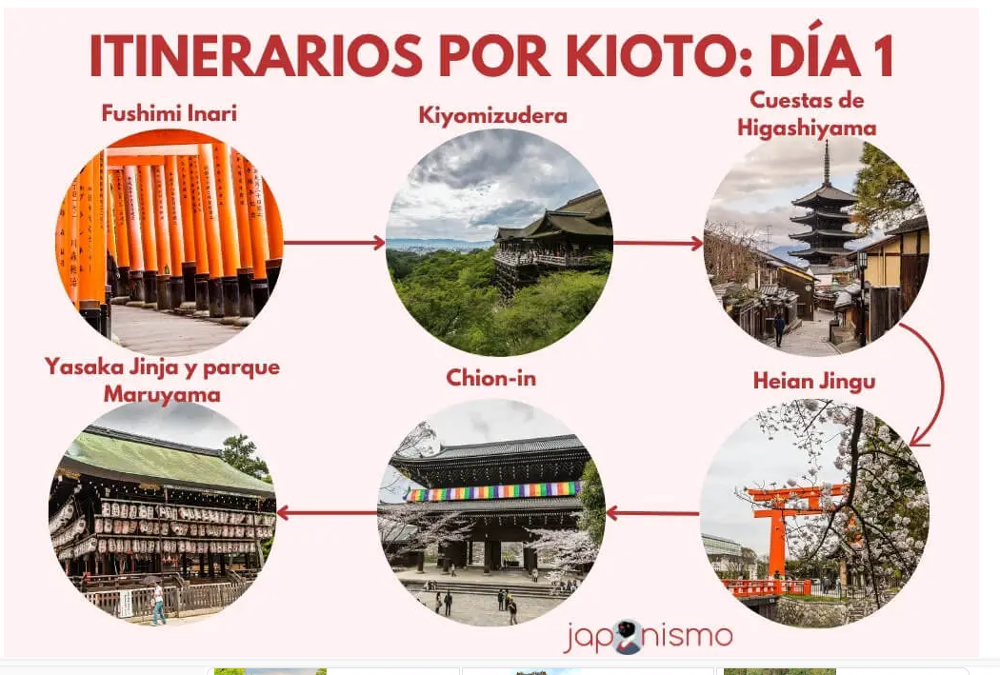
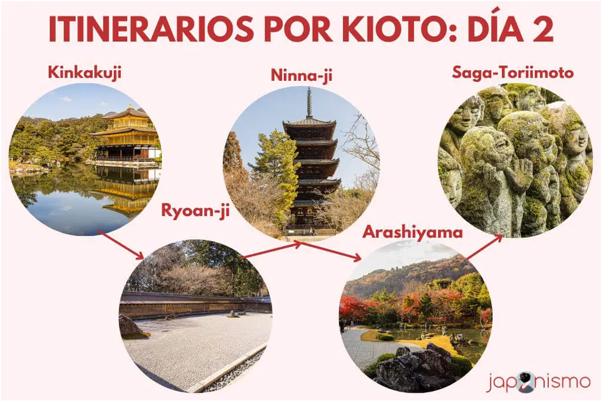
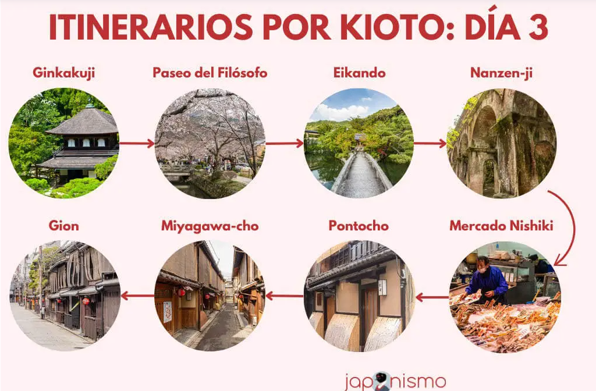

# OSAKA (24 - 27)

- Entrada: desde las 15:00
- Salida: hasta las 11:00
- Mandar maletas a Kioto

## Cosas que ver (Japonismo)

[Referencia para las zonas]((https://japonismo.com/blog/que-ver-y-hacer-en-osaka-guia-basica-de-viaje#que-ver-en-osaka-por-zonas))

---

- Umeda Sky Building y sus maravillosas vistas.
- El Glico Man y los neones de Dotonbori.
- Pasear por Nanba y Amerika-mura.
- El barrio retrofuturista de Shinsekai y la torre Tsutenkaku.
- El gran santuario Sumiyoshi Taisha.
- El mirador de la torre Abeno Harukas.
- El castillo de Osaka y su espectacular parque.
- Pokémon Center

---

### Zona Umeda, Nakanoshima y alrededores

Lo que más me llama dentro de las opciones son:

- Umeda Sky Building
- Santuario Osaka Tenmangu (a 40m a pata desde el Umeda Sky Building)
- Isla de Nakanoshima (pilla "cerca" del Santuario):
    - Ayuntamiento de Osaka
    - Rosaleda (Ver si están las rosas en floración porque dicen que es
      precioso)
    - Crucero por el río (Opcional)

Por el camino pilla un pokemon center :)

[ruta](https://www.google.es/maps/dir/Umeda+Sky+Building,+1+Chome-1-88+%C5%8Cyodonaka,+Kita-ku,+Osaka,+Prefectura+de+Osaka,+Jap%C3%B3n/Pok%C3%A9mon+Center+Osaka,+13F+3+Chome-%EF%BC%91-1+Umeda,+Kita+Ward,+Osaka,+Prefectura+de+Osaka,+Jap%C3%B3n/Osaka+Tenmangu,+2+Chome-1-8+Tenjinbashi,+Kita-ku,+Osaka,+Prefectura+de+Osaka,+Jap%C3%B3n/@34.7007023,135.4960043,16z/data=!3m2!4b1!5s0x6000e710d87f165b:0x4ceb5b056a25047b!4m20!4m19!1m5!1m1!1s0x6000e6889074276f:0x57c2e32670decafd!2m2!1d135.4896527!2d34.7052872!1m5!1m1!1s0x6000e68d79bc2809:0xbe632596444365a3!2m2!1d135.4965591!2d34.7018525!1m5!1m1!1s0x6000e6dba42a1cef:0xa135ef22a79f6eb2!2m2!1d135.5126556!2d34.6960576!3e2?entry=ttu&g_ep=EgoyMDI1MDIwMi4wIKXMDSoASAFQAw%3D%3D)

---

### Honmachi y centro de Osaka

Honmachi es una avenida tochísima.

- Santuario Goryo (parece pequeño)
- Avenida Midosuji (es como la calle de goya en madrid, zona comercial)
- Tekijuku: escuela tradicional japonesa. (todo pilla de camino)
- Sube a un crucero fluvial desde el Muelle de Yodoyabashi (Osaka Aqua Liner
  Yodoyabashi Pier) (Opcional)

---

### Nanba, Shinsaibashi y Dotonbori

#### Nanba y Shinsaibashi

- [shotengai](https://japonismo.com/blog/shotengai-calles-comerciales-japon):
  Calle comercial techada llena de tiendas tradicionales chulas
- Tarta de Queso de Rikuro
- Comida callejera : 551 Horai y sus deliciosos butaman
- Namba Parks y su jardín exterior
- Santuario Namba Yasaka (cerca de Namba Parks)

#### Dontombori (es como una zona en Namba pero muy densa)

Básicamente es un lugar en el que perderse y comer. Zona ideal para visitar y
ver de noche.

#### [Akihabara Electronic Town](https://japonismo.com/blog/viajar-a-osaka-den-den-town)

Zona de cosas Frikis.

---

### Tennoji y Shinsekai

Zona muy humilde

- Ishinnji y Tennoji (dos templos a unos 10m caminando)
- Mirador Abeno Harukas: edificio más alto de Osaka
- Zona
  de [Shinsekai](https://japonismo.com/blog/viajar-osaka-el-barrio-de-shinsekai)
  y torre tsutenkaku
- Santuario Sumiyoshi Taisha: Santuario más importante de la ciudad
  (a 25m en tranvía desde lo anterior)

---

### En la zona sur hay cuchillos XD

---

### Castillo de Osaka y este de la ciudad

- [Entradas japonismo](https://ars-osakacastle.triplabo.jp/home?lang=en)
- [Entradas civitatis en €](https://www.civitatis.com/es/osaka/entrada-castillo-osaka?aid=121&cmp=es_ES&cmpint=_Pmax_Gen%C3%A9rica&&tc_alt=101912&n_okw=___c_&gad_source=1&gclid=CjwKCAiAtYy9BhBcEiwANWQQL1XNglcpgQaaVw0LkGlAvW0dmyMK5YTRsZc-i-y7ZWdKjQMXN27cqBoCwU8QAvD_BwE&gclsrc=aw.ds)
  (Parece que no se pueden sacar con más de un mes de antelación **estar atentos
  **)

- Pasea por los maravillosos jardines del castillo de Osaka, preciosos en
  cualquier época del año. En primavera hay hasta espectáculos de iluminaciones
  nocturnas de los cerezos en flor y un poquito antes, con los ciruelos en flor.

- Más hacia el este, déjate sorprender por el inmenso Parque Tsurumi Ryokuchi.
  Más de 120 hectáreas de parque con muchos cerezos, una casa de té tradicional
  y hasta molinos de viento holandeses. Poco visitado por turistas.

Info:

- El interior del castillo de Osaka está abierto de 09:00 a 17:00 horas. La
  última entrada permitida es a las 16:30 horas.
- El castillo cierra durante las vacaciones de Año Nuevo del 28 de diciembre al
  1 de enero.
- Durante la floración de los cerezos y los ciruelos, así como en verano y en la
  festividad del Obon los horarios se amplían, por lo que te recomendamos que
  consultes los horarios específicos y tarifas de entrada en la web en inglés
  del castillo de Osaka.

---

### Al Oeste solo está el Universal Studios de Japón y poco más.

### Nara

[Mapa de japonismo](https://www.google.com/maps/d/u/0/viewer?mid=1bXrPBeWTAp85GwzSggPHPvxEoIE&ll=34.6846756545768%2C135.82915458166354&z=15)

En un día no podrás visitarlo todo y probablemente tendrás que escoger de entre
las dos grandes zonas que puedes ver en la ciudad. Pero, desde luego, al menos
podrás ver los puntos imprescindibles.

- Parque de Nara
- Templo Todaiji
- Santuario Kasuga Taisha
- Templo Kofukuji
- Naramachi: Barrio separado tradicional (Opcional)
- Templo Horyuji: templo de madera más antiguo del mundo
- Palacio Heijo: parcialmente reconstruido (Opcional)

#### Zonas apartadas:

- Templo Toshodai-ji
- Templo Ganjo-ji
- Templo Yakushi-ji
- Templo Shin-Yakushi
- Monte Wakakusa

## Planning

### Día 24

- llegada 16:00

- Idea: Ver un poco Osaka y cenar en Dontombori

### Día 25

ver osaka

### Día 24

Nara + Osaka

### Día 27

- Viaje a MIYAJIMA

# MIYAJIMA (27 - 28)

- Entrada: 15:00-19:30
- Salida: 7:00-10:00

### Día 27

- Osaka-Hiroshima: (metro + tren + tran) 2h45m
- Hiroshima - Miyahima: (2tren + ferri) 1h30m
  idea: ver Hiroshima + Miyahima

### Día 28

- Miyahima - Himeji (transbordo en Hiroshima): (ferri + tren + tren) 2h20m
- Himeji - Kobe: (caminar + tren) 1h20m
  {
- Kobe - Kioto: (tren + metro) 2h
- Himeji - Kioto: (caminar + tren) 3h
  }
  idea: Ver Miyahima + Himeji + (comer en Kobe) + terminar en Kioto.

# KIOTO (28 - 31)

- Entrada: 15:00-23:00
- Salida: hasta las 11:00
- Mandar maletas a Tokio

## Cosas que ver (Japonismo)

- [Referencia](https://japonismo.com/blog/que-ver-y-hacer-en-kioto-guia-basica-de-viaje)

- [Referencia de Japonismo de Kioto en 3 días](https://japonismo.com/blog/que-ver-kioto-3-dias)

---

- Barrio de Gion y santuario Yasaka Jinja.
- Templo Kiyomizudera y paseo por calles tradicionales de Sannenzaka y
  Ninenzaka.
- Santuario de Fushimi Inari.
- Un paseo por el río Kamo a la altura de Pontocho.
- Templos Kinkaku-ji (pabellón dorado) y Ryoan-ji (el jardín zen seco más famoso
  que hay).
- El castillo de Nijo.
- El templo Ginkaku-ji o pabellón de plata.
- El santuario Heian o Heian Jingu con su torii gigante.
- Arashiyama y su bosque de bambú.
- Paseo del filósofo.

---

### Distribución por días Según Japonismo

#### Día 1

- Santuario Fushimi Inari.
- Templo Kiyomizudera.
- Sannenzaka, Ninezaka y cuestas de Higashiyama.
- Santuario Yasaka y parque Maruyama.
- Templo Chionin.
- Canal Okazaki y santuario Heian.

[ruta en maps](https://www.google.com/maps/dir/Fushimi+Inari-taisha/Kiyomizu-dera/H%C5%8Dkan-ji+Temple+(Yasaka+Pagoda)/Santuario+Yasaka/Parque+Maruyama/Templo+Chion-in/Heian+Jing%C5%AB/@34.9912399,135.7729783,13.87z/data=!4m69!4m68!1m5!1m1!1s0x60010f153d2e6d21:0x7b1aca1c753ae2e9!2m2!1d135.7791876!2d34.9676945!1m5!1m1!1s0x600108d385dcfb07:0x62af658650c434ba!2m2!1d135.784661!2d34.9946662!1m5!1m1!1s0x600108c560f8c421:0xb1cb2441e0223549!2m2!1d135.7791781!2d34.9985583!1m5!1m1!1s0x60010879a010eca9:0xc77ac89d5a241ae9!2m2!1d135.7785534!2d35.0036559!1m25!1m1!1s0x600108dcae68a29b:0xeb260d8a2775cd4b!2m2!1d135.7805269!2d35.0035587!3m4!1m2!1d135.7837885!2d35.0052563!3s0x600108dc745cff77:0x9ea2c90d2693cf8f!3m4!1m2!1d135.7838713!2d35.0052727!3s0x600108dc745cff77:0x9ea2c90d2693cf8f!3m4!1m2!1d135.7839839!2d35.0052699!3s0x600108dc745cff77:0x9ea2c90d2693cf8f!3m4!1m2!1d135.7821961!2d35.0063425!3s0x600108dce2f149a3:0x224def5071f6ed5d!1m10!1m1!1s0x600108dc414283b9:0x609373abd0eaf97c!2m2!1d135.7833827!2d35.0051988!3m4!1m2!1d135.7825601!2d35.0140784!3s0x600108e5ce972a01:0x6a4ecceffefa1160!1m5!1m1!1s0x600108e5187cc88d:0x75bed992d897454f!2m2!1d135.7824263!2d35.0159823!3e2?entry=ttu&g_ep=EgoyMDI1MDIwMi4wIKXMDSoASAFQAw%3D%3D)

---

#### Día 2

- Sendero Kinukake no
  Michi: [ruta en maps](https://www.google.com/maps/dir/Pabellon+Dorado,+1+Kinkakujich%C5%8D,+Kita+Ward,+Kioto,+Prefectura+de+Kioto,+Jap%C3%B3n/Ry%C5%8Dan-ji,+13+Ry%C5%8Danji+Gory%C5%8Dnoshitach%C5%8D,+Uky%C5%8D-ku,+Kioto,+Prefectura+de+Kioto,+Jap%C3%B3n/Ninna-ji,+33+Omuroouchi,+Uky%C5%8D-ku,+Kioto,+Prefectura+de+Kioto,+Jap%C3%B3n/@35.0350111,135.7170276,16z/data=!3m1!4b1!4m20!4m19!1m5!1m1!1s0x6001a820c0eb46bd:0xee4272b1c22645f!2m2!1d135.7292431!2d35.03937!1m5!1m1!1s0x6001a82a301cbaa7:0xe1ab173e46d78542!2m2!1d135.7182634!2d35.0344943!1m5!1m1!1s0x6001077ff3ae5187:0xea1bdd27377bb743!2m2!1d135.7138198!2d35.0310937!3e2?entry=ttu&g_ep=EgoyMDI1MDIwMi4wIKXMDSoASAFQAw%3D%3D)
    - Templos Kinkakuji: llegar a las 9 de la mañana, cuando abren, para poder
      verlo sin tanta gente.
    - Ryoan-ji
    - Ninna-ji.
- Arashiyama: recomiendan ir en tranvía desde el punto anterior. [Ruta en maps](https://www.google.com/maps/dir/Bosque+de+Bamb%C3%BA+de+Arashiyama,+Sagaogurayama+Tabuchiyamach%C5%8D,+Uky%C5%8D-ku,+Kioto,+Prefectura+de+Kioto,+Jap%C3%B3n/Templo+Tenryu-ji,+%EF%BC%96%EF%BC%98+Sagatenry%C5%ABji+Susukinobabach%C5%8D,+Uky%C5%8D-ku,+Kioto,+Prefectura+de+Kioto,+Jap%C3%B3n/Saga+Toriimoto+Preserved+Street,+%E5%B5%AF%E5%B3%A8%E9%B3%A5%E5%B1%85%E6%9C%AC+Uky%C5%8D-ku,+Kioto,+Prefectura+de+Kioto,+Jap%C3%B3n/Adashino+Nenbutsu-ji,+17%E7%95%AA%E5%9C%B0+Sagatoriimoto+Adashinoch%C5%8D,+Uky%C5%8D-ku,+Kioto,+Prefectura+de+Kioto,+Jap%C3%B3n/Otagi+Nenbutsu-ji+Temple,+2-5+Sagatoriimoto+Fukatanicho,+Uky%C5%8D-ku,+Kioto,+Prefectura+de+Kioto,+Jap%C3%B3n/@35.023499,135.6625101,16z/data=!3m1!4b1!4m32!4m31!1m5!1m1!1s0x6001abebbf5c8bad:0xfb9ffc7bbdd67cdd!2m2!1d135.6713013!2d35.0168187!1m5!1m1!1s0x6001aa01b80f9e93:0xcd9c3edaff3348c0!2m2!1d135.6737654!2d35.0158379!1m5!1m1!1s0x6001aa181d378e23:0x4bc8f926efd33b74!2m2!1d135.6677759!2d35.0257661!1m5!1m1!1s0x6001aa3d757dea39:0x38e558a8bebffd1c!2m2!1d135.6655837!2d35.0269658!1m5!1m1!1s0x6001aa3999ac708b:0x57b7af11417a95d2!2m2!1d135.6615546!2d35.0311428!3e2?entry=ttu&g_ep=EgoyMDI1MDIwMi4wIKXMDSoASAFQAw%3D%3D)
  - bosque de bambú 
  - Tenryu-ji 
  - Saga-Toriimoto.
  - 
---

#### Día 3 

- Templo Ginkakuji y Paseo de la Filosofía.
- Templos Eikando y Nanzenji.
- Mercado Nishiki.
- Barrios de geishas: Pontocho, Miyagawa-cho y Gion.

## Planning

### Día 28

idea: cenar

### Día 29

### Día 30

Fushimi Inari (madrugar mucho, que se peta; Esther terminó a las 09:00): 30m

### Día 31

Pensar si reportaje

TOKIO (31 - 6)
------------

- Entrada: desde las 15:00
- Salida: hasta las 11:00

### Día 31

### Día 1

### Día 2

### Día 3

### Día 4

### Día 5

### Día 6

Monte Fuji

Transporte
-----------

--- 

- Osaka - Himeji: (metro + tren) 2h20m
- Himeji - Hiroshima: (tren 1h + caminar 20m + tran) 2h
- Hiroshima - Miyahima: (2tren + ferri) 1h30m
- Miyahima - Kobe: (4 transportes) 3h
- Osaka - Kobe: (2 transportes) 1h15m
- Kobe - Hiroshima: (4 transportes) 2h15m

 ---
